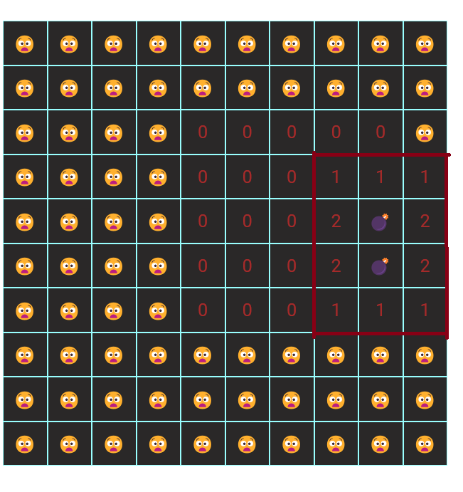
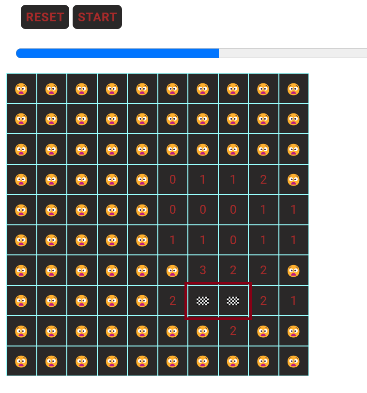

#### Пишем простейшую версию популярной игры 'Сапер':

Проект реализован на базе нативных технологий: HTML, СSS, JAVASCRIPT (ES^6 и более поздние версии) ---

Студенты получают готовую верстку проекта для дальнейшей реализации JS-кода

### Дополнительные ресурсы:

1. Изображения бомб и флажков попыток реализовать с помощью эмодзи: [Emoji](https://emojicopy.com/ "Эмодзи");
2. Шрифт 'Roboto' подключен по CDN c [google fonts](https://fonts.google.com/selection?selected=Material+Symbols+Outlined:sports_soccer:FILL@0;wght@400;GRAD@0;opsz@24&icon.size=24&icon.color=%23e8eaed):

```html
<head>
  <link rel="preconnect" href="https://fonts.googleapis.com" />
  <link rel="preconnect" href="https://fonts.gstatic.com" crossorigin />
  <link
    href="https://fonts.googleapis.com/css2?family=Roboto:ital,wght@0,100;0,300;0,400;0,500;0,700;0,900;1,100;1,300;1,400;1,500;1,700;1,900&display=swap"
    rel="stylesheet"
  />
</head>
```

### Динамическая генерация элементов, отвечающий за клетки поля должна происходить в контейнер:

```html
<section class="field">
  <!-- Dynamic Render Content -->
</section>
```

### Особенности реализации:

1. Главный скрипт - модульный, подключается в </head> документа с атрибутом **defer** (для доступа к элементам DOM-дерева):

```html
<head>
  <script src="./build/index.js" defer type="module"></script>
</head>
```

2. Для удобства, стили разбиты на модули. Каждый отдельный файл подключаетсчя к главному style.css директивой:

```css
@import url(path);
```

3. Состояние каждой клетки, прогресс игрока, массив координат бомб, размер поля и т.д. - вынесем в глобальное состояние нашего проекта (см. файл **state.js**):

```js
export const state = {
  $CELLS: null, // состояние, для хранения HTML-коллекции элементов клеток поля
  field: [], // матрица первонального состояния поля
  row: 5, // количество клеток в ряде
  bombsCoords: [], // массив с координатами бомб
  cellWidth: 50, // ширина клетки, в пикселях
  progress: [], // массив прогресса
  cellState: {
    0: "",
    [-1]: "💣",
    flag: "🏁",
  },
};
```

4. Функция создания матрицы состояния поля (**createInitialFieldState**) должна вызываться единожды, при клике по кнопке **START** (см. файл index.html). Функция должна создавать матрицу **state.field** равную **квадрату state.row** и 'разбрасывать' бомбы в случайном порядке в количестве, не превышающем **state.row**. Если координата бомбы повторяется - последняя не должна попасть в массив с координатами бомб **state.bombsCoords**.<br> Элементы матрицы состояния поля **state.field** - имеют 3 состояния:

- нулевое (число 0);
- бомба (число -1);
- сиблинг - целое положительное число, обозначающее итоговое количество бомб по 8 направлениям(см. далее);

5. Функция отрисовки поля (**drawField**) должна вызываться единожды, сразу после вызова функции **createInitialFieldState**. HTML-шаблон для генерации клетки поля должен иметь вид:

```javascript
// Значение id совпадает с индексом элемента клетки в составе HTML-коллекции state.$CELLS
`<div class='field__cell' id='${i}'> 😧 </div>`;
```

6. Функция стилизации поля (**styleField**) должна вызываться единожды, сразу после вызова функции **drawField**

7. Обработчик событий клика по клеткам **fieldClickHandler** - должен быть добавлен на контейнер поля **$FIELD** и, используя **делегирование**, получать **id** клетки, который должен совпадать с индексом конкретного элемента в HTML-коллекции **state.$CELLS** <br> Важно! при клике на клетку поля с состоянием:

- **ноль** - должны открываться смежные клетки по 8 направлениям (включая диагональные направления);
- **сиблинг** - отображатся целое положительное число, **обозначающее кол-во бомб вблизи этой клетки по 8 направлениям (верх, низ, лево, право, правый-верхний, правый-нижний, левый-верхний, левый-нижний)**;
- c состоянием **бомба** - отображаться эмодзи бомбы (проигрыш)

Картинка, отражающая сиблингов клетки с бомбой по 8 направлениям:



8. После 'открытия' клетки - функция **updateProgress** обновляет состояние массива **state.progress**, добавляя в него только уникальные координаты, исключая координаты бомб! Также, должен изменяться атрибут **value** HTML-элемента c классом **progress_bar** - визуализируя состояние прогресса игрока!

9. Функция **defineBombSiblings** должна находить в матрице **state.field** сиблинги элементов с **бомбой** по **8 направлениям (включая диагональные)**, увеличивая их состояние на единицу. Также, это функция должна обрезать:

- отрицательные элементы;
- элементы с индексами (id) >= **row^2**
- элементы, выходящие за пределы левого и правого краев рабочего поля

10. Функция **resetHandler** должна:

- обнулять прогресс
- формировать новую матрицу состояния поля, путем перезапуска функции **createInitialFieldState**
  и т.п.

11. При клике правой кнопкой мыши по клетке рабочего поля - должен быть вызван обработчик **attemptHandler**, рисующий флажок(промежуточное состояние) в этой клетке:
    
