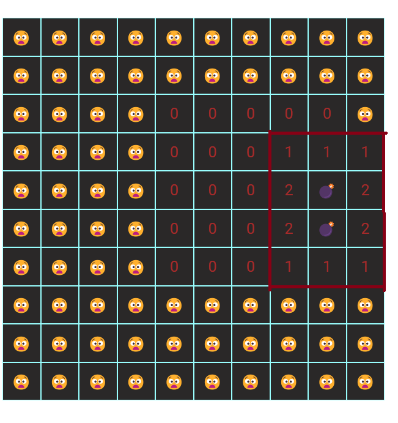

#### Пишем простейшую версию популярной игры 'Сапер':

Проект реализован на базе нативных технологий: HTML, СSS, JAVASCRIPT (ES^6 и более поздние версии) ---

Студенты получают готовую верстку проекта для дальнейшей реализации JS-кода

### Дополнительные ресурсы:

1. Изображения бомб и флажков попыток реализовать с помощью эмодзи: [Emoji](https://emojicopy.com/ "Эмодзи") эмодзи;
2. Шрифт 'Roboto' подключен по CDN c GOOGLE.FONTS:

```html
<head>
  <link rel="preconnect" href="https://fonts.googleapis.com" />
  <link rel="preconnect" href="https://fonts.gstatic.com" crossorigin />
  <link
    href="https://fonts.googleapis.com/css2?family=Roboto:ital,wght@0,100;0,300;0,400;0,500;0,700;0,900;1,100;1,300;1,400;1,500;1,700;1,900&display=swap"
    rel="stylesheet"
  />
</head>
```

### Особенности реализации:

1. Главный скрипт - модульный, подключается в </head> документа с атрибутом **defer** (для доступа к элементам DOM-дерева):

```html
<head>
  <script src="./build/index.js" defer type="module"></script>
</head>
```

2. Для удобства, стили разбиты на модули. Каждый отдельный файл подключаетсчя к главному style.css директивой:

```css
@import url(path);
```

3. Состояние каждой клетки, прогресс игрока, массив координат бомб, размер поля и т.д. - вынесем в глобальное состояние нашего проекта (файл **state.js**):

```js
export const state = {
  field: [], // матрица первонального состояния поля
  row: 5, // количество клеток в ряде
  bombsCoords: [], // массив с координатами бомб
  cellWidth: 50, // ширина клетки, в пикселях
  progress: [], // массив прогресса
  cellState: {
    0: "",
    [-1]: "💣",
  },
};
```

4. Функция создания матрицы состояния поля (createInitialFieldState) должна вызываться единожды, при клике по кнопке **START**. Функция должна создавать матрицу **field** размерностью (**row^2**) и 'разбрасывать' бомбы в случайном порядке в количестве, не превышающем **row**. Если координата бомбы повторяется - последняя непопадет в массив с координатами бомб **bombsCoords**.<br> Элементы матрицы состояния поля **field** - имеют 3 состояния:

- нулевое (число 0);
- бомба (число -1);
- сиблинг - целое положительное число;

5. Функция отрисовки поля (**drawField**) должна вызываться единожды автоматически, после вызова **createInitialFieldState**

6. Функция стилизации поля (**styleField**) должна вызываться единожды автоматически, после вызова **drawField**

7. Обработчик событий клика по клеткам **fieldClickHandler** - должен быть добавлен на контейнер поля **$FiELD** и, используя паттерн 'Делегирования', распознавать **id** клетки.<br> Важно! при клике на клетку: - с **нулевым** состоянием, должны открываться смежные клетки по 8 направлениям (включая диогональное направление);

- c состоянием **сиблинг** - просто отображать положительное число;
- c состоянием бомба - отображать эмодзи бомбы (проигрыш)

8. После 'открытия' клетки - мы должны обновлять состояние массива **progress**, добавляя в него только уникальные координаты, исключая координаты бомб!

9. Функция **defineBombSiblings** должна определять сиблинги по **8 направлениям (включая диагональное)** по отношению к элементу с состоянием **бомба**, увеличивая их состояние на единицы. Также, это функция должна обрезать:
   

- отрицательные элементы;
- элементы >= **row^2**
- элементы, выходящие за пределы левого и правого краев рабочего поля

10. Функция **resetHandler** должна сбрасывать прогресс и формировать новую матрицы состояния поля
